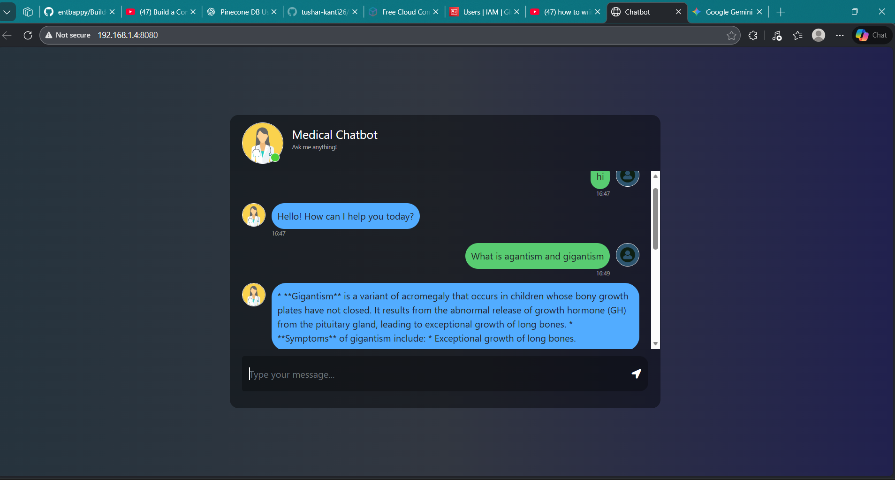
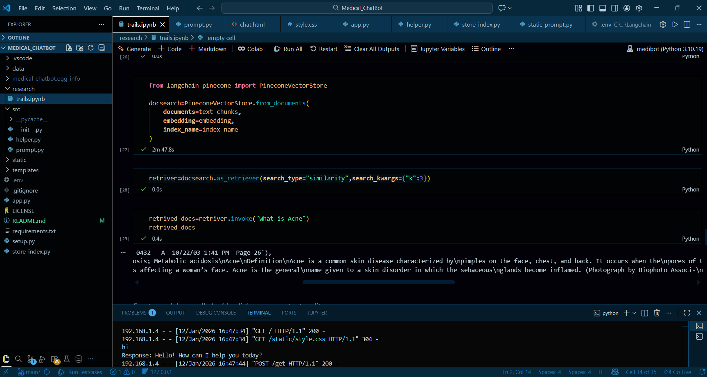
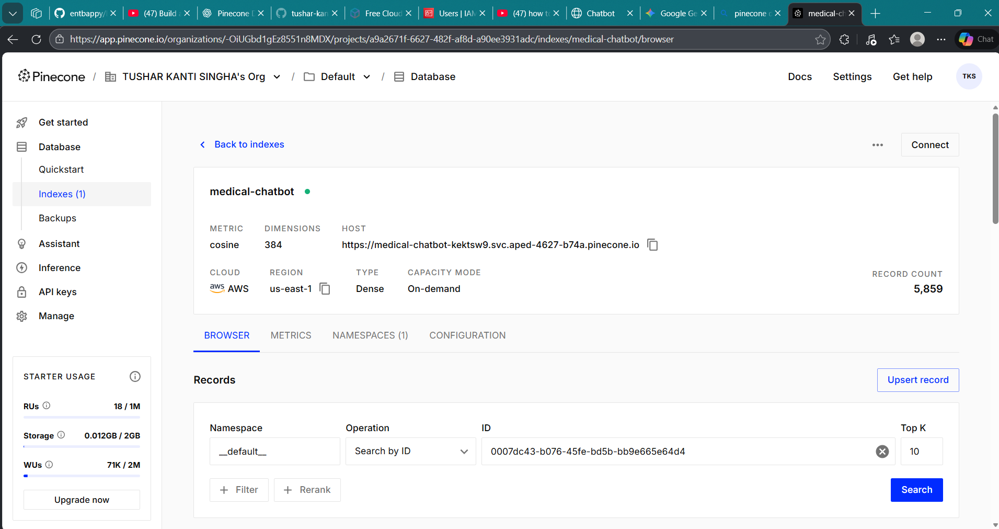

# 🏥 Medical ChatBot

An AI-powered medical assistant designed to provide accurate information by leveraging Retrieval-Augmented Generation (RAG). This project uses **Gemini** for reasoning, **Pinecone** for vector search, and **LangChain** for orchestration, all wrapped in a sleek **Flask** web interface.

---

## 🖼️ Project Screenshots

### **Chatbot Interface**
| User Conversation | Code |
| :---: | :---: |
|  |  |

<br>

### **Vector Database (Pinecone)**
<p align="center">
  
  <br>
  <em>Visualizing medical document embeddings stored in Pinecone</em>
</p>

---

## 🌟 Features

* **RAG Integration:** Uses Pinecone to retrieve relevant medical context before generating answers.
* **LLM Powered:** Utilizes Google’s Gemini API for high-quality conversational responses.
* **Vector Storage:** Efficiently stores and searches medical document embeddings.
* **Web UI:** A user-friendly interface built with Flask, HTML, and CSS.
* **Security First:** Environment variable management to protect sensitive API keys.

---

## 🛠 Tech Stack

| Technology | Purpose |
| :--- | :--- |
| **Python** | Core programming language |
| **LangChain** | LLM orchestration and RAG framework |
| **Gemini API** | Large Language Model (Google) |
| **Pinecone** | Vector database for similarity search |
| **Flask** | Web framework for the frontend |

---

## 📂 Project Structure

```text
Medical_ChatBot/
├── data/              # Medical documents / PDFs for embeddings
├── screenshots/       # Project images (Chatbot and Pinecone)
├── src/               # Core source code (LLM chains, helpers)
├── static/            # Frontend assets (CSS, JS, images)
├── templates/         # HTML templates for Flask UI
├── .env               # Environment variables (Private)
├── app.py             # Main Flask application
├── store_index.py     # Script to create & store embeddings
├── requirements.txt   # Python dependencies
└── README.md          # Documentation

🚀 Getting Started
🔹 Step 1: Clone the Repository

   git clone [https://github.com/tushar-kanti26/Medical_ChatBot.git](https://github.com/tushar-kanti26/Medical_ChatBot.git)
   cd Medical_ChatBot

🔹 Step 2: Setup Environment

    conda create -n medibot python=3.10 -y
    conda activate medibot
    pip install -r requirements.txt

🔹 Step 3: Run the Project
    1.Add your PINECONE_API_KEY and GEMINI_API_KEY to the .env file.

    2.Run python store_index.py to process PDFs.

    3.Run python app.py to start the server.

    4.Visit http://localhost:5000.